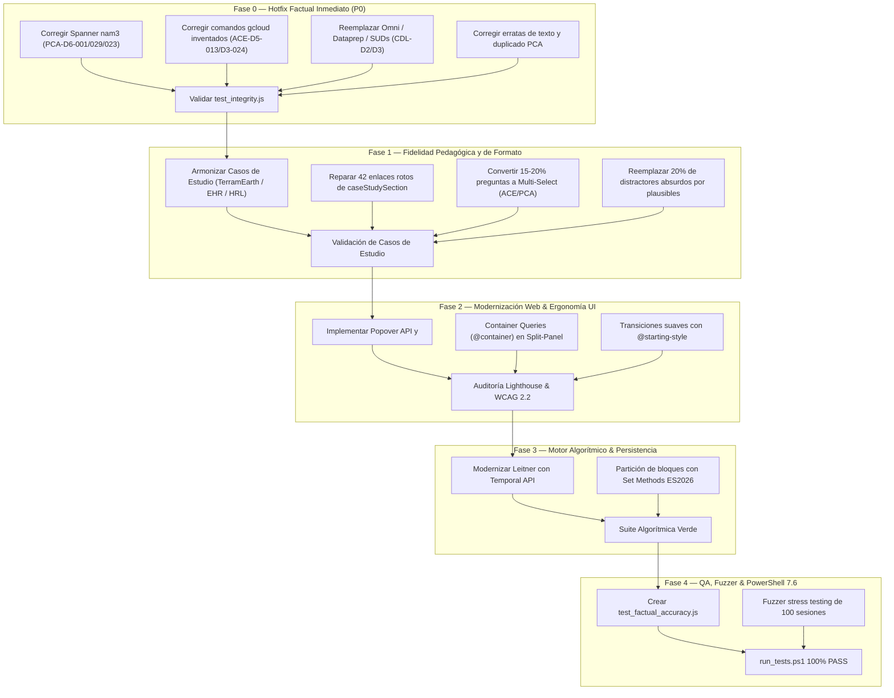

# Índice Maestro de Mejoras — Google Cloud Master Certification Studio

**Versión:** 2.1.0  
**Fecha:** Agosto 2026  
**Ruta Base del Proyecto:** `c:\DevWork\Certificaciones-GCP-Master-Studio\plataforma_entrenamiento_master`  
**Estado:** Documentación Técnica Exhaustiva de Mejoras  

---

## 1. Estructura de Guías de Mejora por Componente

Esta serie de documentos constituye el plan técnico integral para elevar la plataforma a nivel de producción de grado empresarial y máxima fidelidad oficial con los exámenes de Google Cloud:

```
plataforma_entrenamiento_master/docs/
├── 00_INDICE_MAESTRO_DE_MEJORAS.md               # Este documento (Visión general y roadmap)
├── 01_GUIA_MEJORA_BANCO_PREGUNTAS_Y_CONTENIDO.md # Corrección P0, Casos de Estudio, Multi-Select y Distractores
├── 02_GUIA_MEJORA_FRONTEND_UI_UX_ACCESIBILIDAD.md# Popover API, <dialog>, Container Queries, WCAG 2.2 AA
├── 03_GUIA_MEJORA_ALGORITMIA_Y_PERSISTENCIA.md   # ES2026 Sets, Temporal API Leitner, Probabilidad, CRC-32
├── 04_GUIA_MEJORA_QA_TESTING_Y_DEVOPS_PWSH.md    # Test suites, test_factual_accuracy.js, pwsh 7.6 runner
└── ESPECIFICACION_Y_RUBRICA_PARA_EVALUACION_IA.md# Rúbrica de evaluación objetiva binaria (EVAL-01 a EVAL-07)
```

---

## 2. Matriz de Priorización de Mejoras

| Prioridad | Área de Impacto | Archivo Guía | Acciones Clave |
|---|---|---|---|
| **P0 (Bloqueante)** | Precisión Factual de Preguntas | `01_GUIA_MEJORA_BANCO_PREGUNTAS_Y_CONTENIDO.md` | Corregir los 13 reactivos con respuestas/comandos incorrectos (Spanner nam3, gcloud CLI flags, BigQuery Omni, Dataprep, SUDs). |
| **P1 (Crítica)** | Fidelidad de Casos de Estudio & Examen | `01_GUIA_MEJORA_BANCO_PREGUNTAS_Y_CONTENIDO.md` | Armonizar TerramEarth/EHR, arreglar 42 `caseStudySection` rotos e introducir 15-20% de preguntas Multi-Select. |
| **P1 (Crítica)** | Modernización UI & Split-Panel | `02_GUIA_MEJORA_FRONTEND_UI_UX_ACCESIBILIDAD.md` | Usar CSS Container Queries en Split-Panel, `<dialog>` nativo y Popover API para tooltips y modales. |
| **P2 (Importante)**| Algoritmia & Gestión Temporal | `03_GUIA_MEJORA_ALGORITMIA_Y_PERSISTENCIA.md` | Implementar `Temporal API` para curvas Leitner y métodos algebraicos de `Set` para rotación de bloques. |
| **P2 (Importante)**| Pipeline QA & Automatización | `04_GUIA_MEJORA_QA_TESTING_Y_DEVOPS_PWSH.md` | Crear `test_factual_accuracy.js` e integrarlo en `run_tests.ps1` con PowerShell 7.6. |

---

## 3. Roadmap de Ejecución Sugerido


