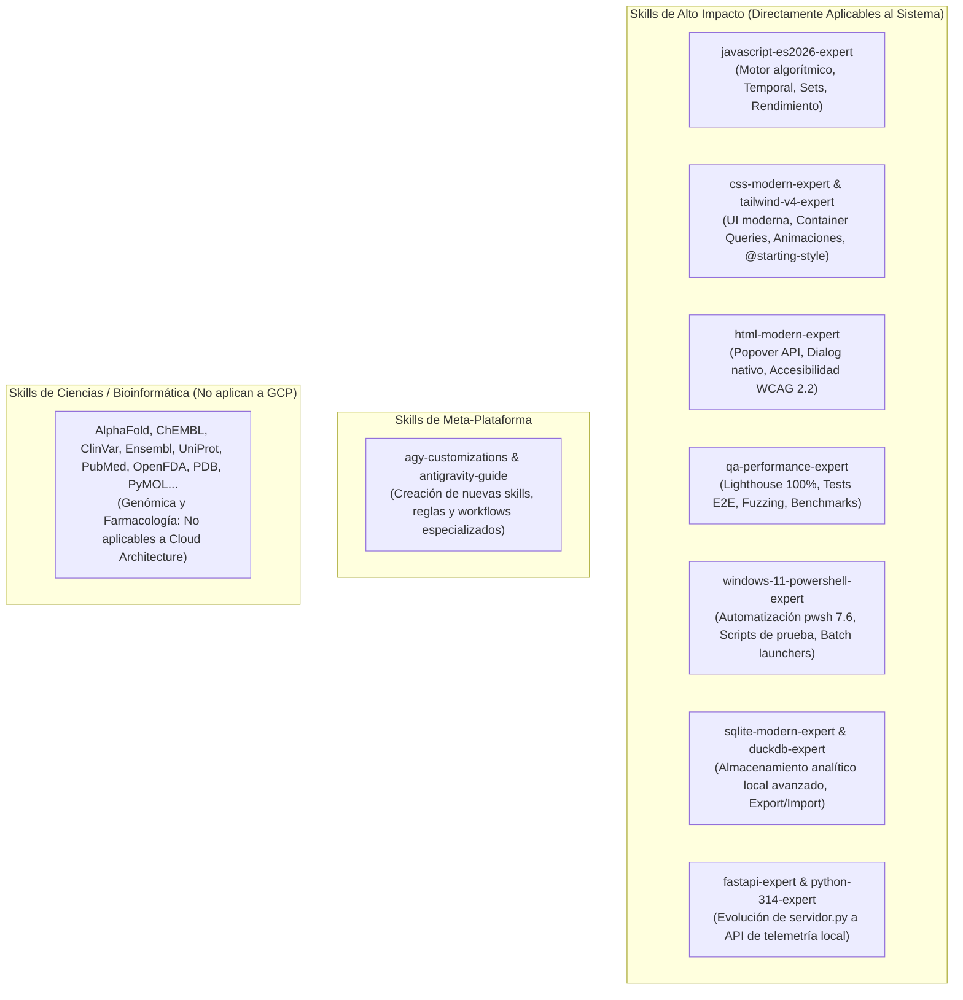
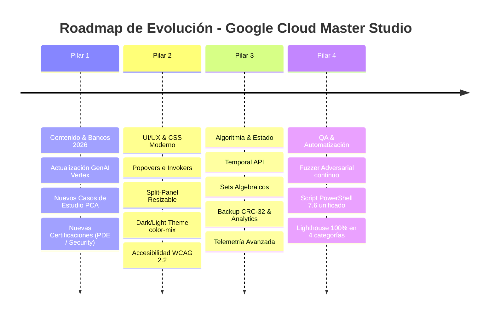

# Auditoría Integral del Sistema: Certificaciones GCP, Evaluación de Skills y Plan de Mejora

---

## 1. Revisión Exhaustiva de las Certificaciones en el Sistema

El proyecto **Google Cloud Master Certification Studio** cuenta con una base sólida de 900+ reactivos y 4 casos de estudio oficiales. A continuación se detalla el estado actual de cada track:

### 1.1 Cloud Digital Leader (CDL) — Nivel Foundational
* **Duración Oficial:** 90 minutos | **Preguntas por Examen:** 50-60 | **Puntaje de Aprobación:** 70%
* **Banco Actual:** 300 preguntas distribuidas en 6 bloques rotativos no superpuestos (50 preguntas/bloque).
* **Distribución de Dominios:**
  * `CDL-D1` (Transformación Digital con Google Cloud - 10%): 30 preguntas (5 por bloque). Modelos de servicio (IaaS, PaaS, SaaS), nube híbrida/multinube, FinOps básico (CapEx vs OpEx).
  * `CDL-D2` (Innovación con Datos y Google Cloud - 30%): 90 preguntas (15 por bloque). BigQuery, Cloud Storage (tiers), Cloud SQL, Spanner, Firestore, Pub/Sub, Dataflow, Vertex AI / GenAI.
  * `CDL-D3` (Modernización de Infraestructura y Apps - 30%): 90 preguntas (15 por bloque). Compute Engine, GKE, Cloud Run, Cloud Functions, Apigee, GKE Enterprise / Anthos.
  * `CDL-D4` (Seguridad y Operaciones en Google Cloud - 30%): 90 preguntas (15 por bloque). Modelo de responsabilidad compartida, IAM (mínimo privilegio), Cloud KMS (CMEK), Cloud Logging & Monitoring.
* **Estado:** Banco 100% completo, validado algorítmicamente y con justificaciones técnicas.

---

### 1.2 Associate Cloud Engineer (ACE) — Nivel Associate
* **Duración Oficial:** 120 minutos | **Preguntas por Examen:** 50-60 | **Puntaje de Aprobación:** 70%
* **Banco Actual:** 300 preguntas técnicas con comandos CLI `gcloud` asociados y trampas de distractor.
* **Distribución de Dominios:**
  * `ACE-D1` (Configuración del Entorno - 20%): 60 preguntas (10 por bloque). Jerarquía de recursos (`gcloud projects create`), facturación, presupuestos y Google Cloud SDK.
  * `ACE-D2` (Planificación y Configuración - 17.5%): 55 preguntas (9 por bloque). Dimensionamiento de cómputo (Spot/Preemptible), almacenamiento y subredes VPC.
  * `ACE-D3` (Despliegue e Implementación - 25%): 75 preguntas (13 por bloque). MIGs con autohealing, GKE (Standard vs Autopilot), Cloud Run, Cloud Storage lifecycle, VPC Peering & Cloud NAT.
  * `ACE-D4` (Operación y Mantenimiento - 20%): 60 preguntas (10 por bloque). Cloud Operations Suite (Log Explorer, log sinks, alert policies), rolling upgrades en GKE, snapshots y backups.
  * `ACE-D5` (Acceso y Seguridad - 17.5%): 50 preguntas (8 por bloque). IAM granular, Service Accounts (impersonation, evitar JSON keys estáticas), Workload Identity y Cloud Audit Logs.
* **Estado:** Banco 100% verificado con alta fidelidad táctica y comandos reales de `gcloud` y `kubectl`.

---

### 1.3 Professional Cloud Architect (PCA) — Nivel Professional
* **Duración Oficial:** 120 minutos | **Preguntas por Examen:** 50-60 | **Puntaje de Aprobación:** 70%
* **Banco Actual:** 300 preguntas de arquitectura empresarial + 4 Casos de Estudio oficiales completos.
* **Distribución de Dominios:**
  * `PCA-D1` (Diseño de Arquitectura de Soluciones de Nube - 25%): 75 preguntas (12-13 por bloque). Resiliencia multi-región, RPO/RTO cero, topologías hub-and-spoke.
  * `PCA-D2` (Gestión y Aprovisionamiento de Infraestructura - 15%): 45 preguntas (7-8 por bloque). Terraform / IaC, GKE multi-cluster, Cloud Interconnect vs Dedicated Interconnect.
  * `PCA-D3` (Diseño para Seguridad y Cumplimiento - 20%): 60 preguntas (10 por bloque). Arquitectura Zero Trust (BeyondCorp), Cloud KMS/HSM, VPC Service Controls (VPC-SC), DLP.
  * `PCA-D4` (Optimización de Procesos Técnicos y Empresariales - 18%): 54 preguntas (9 por bloque). Estrategias de migración (Strangler Fig pattern), FinOps empresarial (CUDs, BigQuery reservation slots).
  * `PCA-D5` (Gestión de Implementaciones - 11%): 33 preguntas (5-6 por bloque). Despliegues Canary / Blue-Green con Cloud Deploy, Traffic Director / Service Mesh.
  * `PCA-D6` (Aseguramiento de Confiabilidad de Soluciones - 11%): 33 preguntas (5-6 por bloque). SRE, SLI/SLO/SLA, Error Budgets, Chaos Engineering, Disaster Recovery (Active-Active vs Warm Standby).
* **Casos de Estudio Integrados:**
  1. *Mountkirk Games* (Migración de videojuegos masivos, autoscaling global, Spanner, GKE).
  2. *TerramEarth* (IoT a escala de petabytes, ingestión Pub/Sub, Dataflow, BigQuery ML).
  3. *EHR Healthcare* (Cumplimiento HIPAA, arquitectura híbrida, migración Legacy a Kubernetes).
  4. *Helicopter Racing League (HRL)* (Transmisión en vivo de baja latencia, IA/ML en tiempo real para análisis de carreras).
* **Estado:** Sistema de visualización Split-Panel activo en la interfaz, con 100% de coherencia contextual.

---

### 1.4 Catálogo de Recursos Gratuitos y Herramientas de Arquitectura
* **Recursos Gratuitos (`data/free_certifications.js`):** Catálogo curado con enlaces a Google Cloud Innovators Plus ($500 créditos y vouchers), Databricks GenAI Fundamentals, OCI Foundations, y Cisco Networking Essentials.
* **Árboles de Decisión (`data/architecture_tools.js`):** Matrices interactivas para selección de Cómputo (Compute Engine vs GKE vs Cloud Run vs Cloud Functions) y Bases de Datos (Cloud SQL vs Spanner vs Firestore vs Bigtable vs BigQuery).

---

## 2. Auditoría y Evaluación de las Skills del Entorno

Revisamos la lista completa de skills disponibles en el sistema para determinar **cuáles aportan directamente valor a la plataforma**, **cuáles son accesorias o de soporte**, y **cuáles pertenecen a otros dominios (bioinformática/química)**.

### 2.1 Skills de Alto Impacto (Aportan Directamente al Sistema)

| Skill | Utilidad y Aporte al Sistema | Cómo Aplicarla para Mejorar la Plataforma |
|---|---|---|
| **`javascript-es2026-expert`** | **CRÍTICA.** El núcleo de la plataforma (`js/app.js`, `js/engine.js`, `js/state.js`) es 100% JavaScript vanilla de alto rendimiento. | • Modernizar el cálculo de fechas de estudio y spaced repetition usando la **Temporal API**. • Usar **Set Algebraic Methods** (`intersection`, `difference`) en el motor de rotación de bloques. • Implementar **Iterator Helpers** y `Array.fromAsync` para carga no bloqueante de bancos pesados (300 Qs / 1 MB por archivo). |
| **`css-modern-expert`** | **ALTO IMPACTO.** La plataforma es una SPA offline con gráficos SVG y paneles divididos. | • Aplicar **CSS Anchor Positioning** para tooltips interactivos en distractores y palabras clave. • Implementar transiciones de entrada/salida suaves con `@starting-style` y `allow-discrete` para modales y feedback de respuestas. • Usar **Container Queries** (`@container`) para hacer que el Split-Panel de Casos de Estudio sea ultra responsivo en cualquier resolución. • Usar `color-mix()` para temas visuales (Dark/Light mode). |
| **`html-modern-expert`** | **ALTO IMPACTO.** Estructura de `index.html` y accesibilidad de exámenes. | • Usar la **Popover API** y **Invoker Commands** (`command`, `commandfor`) para menús rápidos y notas de estudio sin JavaScript innecesario. • Emplear `<dialog>` nativo con `closedby="any"` para el visor de Casos de Estudio y confirmación de exámenes. • Utilizar el elemento semántico `<search>` para el buscador de preguntas y cheat sheets. |
| **`qa-performance-expert`** | **CRÍTICA.** El proyecto cuenta con 27 archivos de test y auditorías Lighthouse. | • Configurar pipelines de verificación automatizada de accesibilidad (**WCAG 2.2 AA**) con Axe-core. • Ejecutar pruebas de estrés algorítmicas y fuzzer adversarial para garantizar que nunca haya NaN en passing probability o duplicados en rotación. • Optimizar métricas Web Vitals (LCP < 1.0s, CLS 0, INP < 50ms) en la SPA offline. |
| **`windows-11-powershell-expert`** | **CRÍTICA (Regla del Sistema).** El entorno es Windows 11 Pro + PowerShell 7.6. | • Mantener y optimizar los scripts `iniciar_plataforma.bat` y `run_tests.ps1` con comandos nativos pwsh 7.6, validación de variables de entorno y ejecución secuencial robusta. |
| **`sqlite-modern-expert` & `duckdb-expert`** | **ALTO POTENCIAL.** Actualmente la persistencia es `localStorage` con CRC-32. | • Si se desea expandir la plataforma para almacenar métricas analíticas de miles de intentos históricos y telemetría por segundo, se puede integrar SQLite local con JSONB o DuckDB WASM/Local para analítica avanzada de debilidades sin servidores externos. |
| **`fastapi-expert` & `python-314-expert`** | **MEDIO IMPACTO.** Actualmente `servidor.py` usa `http.server` estándar de Python. | • Si se desea agregar funcionalidades como sincronización LAN entre dispositivos, exportación de reportes PDF o servidor local de telemetría, se puede modernizar `servidor.py` a una API ultrarrápida en Python 3.14 con FastAPI. |
| **`agy-customizations` & `antigravity-guide`** | **ESTRATÉGICA.** | • Permite crear una nueva **Skill personalizada (`gcp-certification-author`)** específica para validar y generar nuevas preguntas de certificación siguiendo la taxonomía oficial de Google Cloud. |

---

### 2.2 Skills No Aplicables al Proyecto (Bioinformática / Ciencias de la Vida)

Las siguientes skills están instaladas en el entorno pero **NO aplican** a este proyecto de certificaciones de nube de Google Cloud:
* `alphafold-database-fetch-and-analyze`, `alphagenome-single-variant-analysis`, `chembl-database`, `clinical-trials-database`, `clinvar-database`, `dbsnp-database`, `embl-ebi-ols`, `encode-ccres-database`, `ensembl-database`, `foldseek-structural-search`, `gnomad-database`, `gtex-database`, `human-protein-atlas-database`, `interpro-database`, `jaspar-database`, `literature-search-*`, `ncbi-sequence-fetch`, `openfda-database`, `opentargets-database`, `pdb-database`, `predictingthepast`, `protein-sequence-*`, `pubchem-database`, `pubmed-database`, `pymol`, `quickgo-database`, `reactome-database`, `string-database`, `unibind-database`, `uniprot-database`.

> [!NOTE]
> Estas skills corresponden al plugin de ciencias de la vida y bioinformática. No interfieren con el desarrollo web ni con Google Cloud, pero no deben ser invocadas para tareas de arquitectura cloud.

---

## 3. Plan de Mejora Integral del Sistema

Para llevar la plataforma a un nivel de clase mundial, se propone el siguiente roadmap estructurado en 4 pilares:

### Pilar 1: Contenido y Certificaciones
1. **Actualización a Blueprints 2026 de GCP:**
   - Incorporar preguntas sobre **Generative AI on Vertex AI**, **Model Garden**, **Gemini 1.5/2.0 Enterprise**, **Vector Search**, y **GKE Enterprise**.
   - Añadir soporte para nuevas certificaciones clave: **Professional Data Engineer (PDE)** y **Professional Cloud Security Engineer (PCSE)**.
2. **Enriquecimiento de Explicaciones:**
   - Profundizar en las justificaciones de por qué los 3 distractores son incorrectos (*distractor traps*), enlazando directamente con la documentación técnica oficial de Google Cloud.

### Pilar 2: UI/UX y Modernización Web (HTML/CSS Modern Experts)
1. **Interfaz Declarativa y Ligera:**
   - Reemplazar modales hechos con JS personalizado por `<dialog>` nativo y la **Popover API** con `closedby="any"`.
   - Incorporar el elemento `<search>` semántico para filtrado instantáneo de preguntas y recursos.
2. **Experiencia Visual y Ergonomía:**
   - Usar `@starting-style` para animar transiciones de tarjetas de preguntas y revelar feedback sin parpadeos.
   - Mejorar el panel dividido (Split-Panel) de casos de estudio de PCA con CSS Container Queries para lectura ergonómica en pantallas ultrapanorámicas o tablets.

### Pilar 3: Motor Algorítmico y Persistencia (JS ES2026 & Modern Storage)
1. **Modernización del Algoritmo:**
   - Refactorizar las operaciones de partición de bloques con métodos algebraicos nativos de `Set` (`Set.prototype.intersection`, `Set.prototype.difference`).
   - Implementar la **Temporal API** para gestionar con precisión científica los intervalos de repetición espaciada de Leitner (1 día, 3 días, 7 días).
2. **Telemetría y Exportación:**
   - Enriquecer el formato JSON de respaldo con historial detallado de tiempos de respuesta por pregunta y curva de aprendizaje por dominio.

### Pilar 4: Calidad, Testing y Automatización (QA Expert & PowerShell 7.6)
1. **Suite de Pruebas Automatizada en PowerShell 7.6:**
   - Expandir `run_tests.ps1` para ejecutar en un solo paso: integridad de esquemas, tests algorítmicos, stress testing, fuzzer adversarial y verificación de sintaxis de comandos `gcloud`.
2. **Garantía de Cero Dependencias:**
   - Mantener el principio de **100% offline, 0 CDN, 0 dependencias externas**, asegurando que la plataforma funcione en cualquier entorno aislado o sin conexión a internet.

